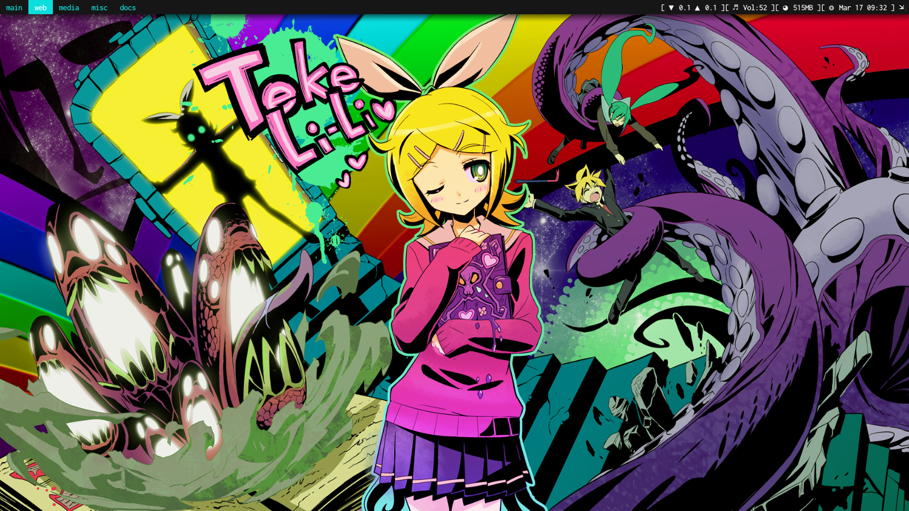
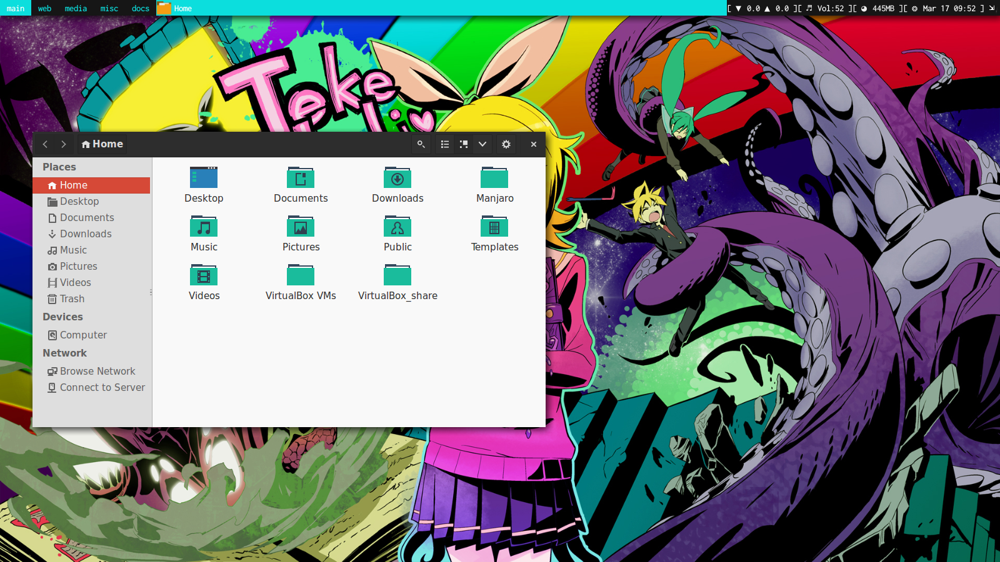
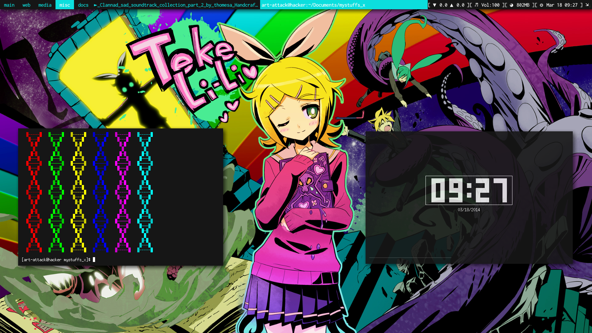

Arch linux config files for awesome_wm 3.5

You should change the name "art-attack" to your your username in awesome_wm config files(i.e rc.lua and theme.lua) which is inside the .config/awesome directory to make it work properly and remember copy the all dotfiles(eg- .Xresources) in your home folder.

**Stuffs i have used/done in my config files**

Don't worry i already set all those,u just need install this packages:

*arch users*

 # sudo pacman -S compton alsa-utils rxvt-unicode

*ubuntu users*

 # sudo apt-get install rxvt alsa-utils

 # sudo apt-add-repository ppa:richardgv/compton

 # sudo apt-get update && sudo apt-get install compton

- compton_ (shadding/effects)

- alsa-utils (sound)

- rxvt-unicode (terminal)

And if u want to set **GTK** themes and also icons like me (see it down.. snapshots)

then,take a look at this.. here_

And after all completes.. make a reboot to your computer so as to take a change in *Awesome_WM_*.

Snapshots
-----------------

see here i used **GTK** theme and icon ⇩

and here my .Xresources config (terminal display)

thank u..

.. _here: http://awesome.naquadah.org/wiki/Customizing_GTK_Apps
.. _Awesome_WM: http://awesome.naquadah.org/wiki/Main_Page
.. _compton: https://github.com/chjj/compton
